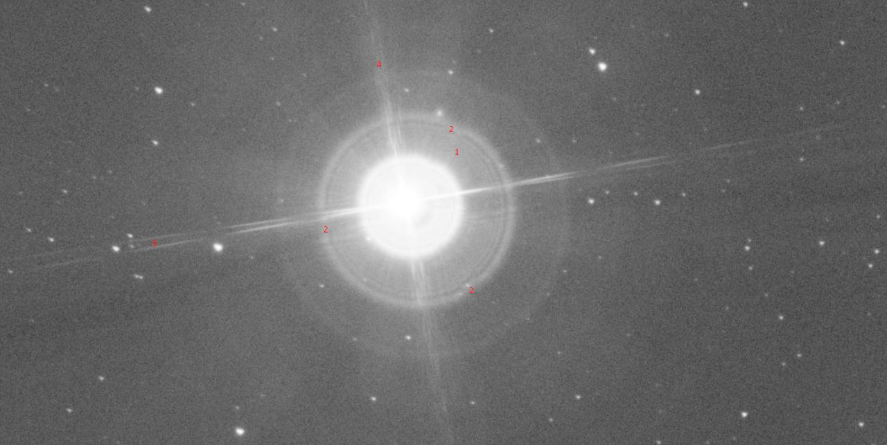

## Основные аберрации оптических систем и тестирование телескопа по звезде
---------------

### Сферические аберрации

Сферическая аберрация - апертурная аберрация, один из самых известных дефектов изображения. Разные кольцевые зоны светового пучка (лучи) при наличие этой аберрации фокусируются на разных расстояниях от номинальной плоскости изображения (совпадает с фокальной если предмет находится на "бесконечности"). В изображениях звезд появляются широкие осесимметричные ореолы с быстро уменьшающейся по мере удаления от центра изображения яркостью. Дифракционное изображение характеризуется усилением видимости колец (которые в норме обычно едва заметны) вокруг пятна Эйри по сравнению с каноническим дифракционным изображением.

Лучи оптического пучка испорченного сферической аберраций образуют каустику - воронкообразную поверхность с "бесконечной" (в геометрическом приближении) плотностью световой энергии. Каустика располагается до плоскости изображения при отрицательной величине аберрации. Каустика подчеркивает яркость края расфокусированного пятна в изображении звезды и служит надежным индикатором остаточной сферической аберрации при тестировании оптики по звездам. Если при достаточно большом (2D) увеличении пятно расфокусировки звезды или другого условно точечного тест-предмета в предфокале (фокусер немного глубже, чем надо) имеет яркий резко очерченный край, а в зафокале (фокусер немного выдвинут по сравнению со сфокусированным изображением) внешний край более тусклый и размытый, то имеем отрицательную сферическую аберрацию (или другими словами недокомпенсированную), и наоборот.

Величина поперечной классической сферической аберрации (диаметры ореолов вокруг звезд) имеет кубическую зависимость от диаметра зоны пучка - апертуры объектива. Поэтому эта аберрация входит в число аберраций третьего порядка (куб - третья степень). Продольная сферическая (длина размазывания фокуса вдоль оси) пропорциональна квадрату диаметра кольцевой зоны (апертуры), а соответствующая деформация волнового фронта описывается уравнение четвертой степени от диаметра кольцевой зоны (апертуры). Проявления сферической аберрации третьего порядка одинаковы по всему полю изображения - то есть не зависят от полевого угла и положения изображения в рамках поля зрения.

Типичная мера по исправлению сферической аберрации в оптике - комбинация положительной и отрицательной линз разной степени симметричности (различия в величине радиуса кривизны двух оптических поверхностей). Например, объектив ахроматического дублета составлен из более-менее симметричной положительной линзы и отрицательного компонента с формой ближе к менискообразной (менискообразные линзы вносят большее значение сферической, чем симметричные, например, двояковыпуклые)

### Хроматические осевые аберрации

 Хроматические аберрации приводят к появлению окрашенной каймы вокруг изображения высоко контрастного предмета. Эти аберрации вызваны различной степенью отклонения призмой лучей с различными длинами волн. Фиолетовые лучи преломляются сильнее, чем красные. Это происходит потому, что показатель преломления материала зависит от длины волны света. Для количественной характеристики дисперсии применяется число Аббе(v). Чем оно выше, тем меньше дисперсия.

Звезды, Луна, планеты и большинство небесных тел  не окрашены явно в один из монохромных радужных цветов. Их изображение строится всеми цветами, так что только для одной длины волны света можно сформировать резкий вид таких объектов наблюдения - остальные в большей или меньшей степени расфокусированы и, смешиваясь, придают диффузный (размытый) вид всему изображению с цветными каемками в местах перепада яркостей (например, по краю лимба Луны). Обычно для минимизации проявлений хроматизма фокусируются по зеленой длине волны обозначаемой в солнечном спектре буквой e (546.1 нм, к ней наш глаз днем наиболее чувствителен), красный и синий получаются немного не в фокусе и, например, вокруг изображения звезды образуют пурпурный (смешение красного и синего) ореол. Замечу, что если хроматические ореолы более заметны вокруг ярких звезд и контрастных объектов, то общая "мыльность" изображения убивает детализацию как яркого, так и тусклого изображения.

Дисперсию стекла (разность преломления для разных длин световых волн) в расчетной оптике принято оценивать коэффициентом Аббе:

## $\nu_e = \frac{n_e - 1}{n_{F'} - n_{C'}}$

где $n_e$ - показатель преломления данной марки стекла для зеленой длины волны e (546.1 нм), ${n_{F'}}$ - показатель преломления данной марки стекла для синей длины волны F (480.1 нм), ${n_{C'}}$ - показатель преломления данной марки стекла для красной длины волны С' (643.8 нм)

Зная коэффициент Аббе, нетрудно посчитать величину первичного хроматизма положения (именно так "по науке" называется эта аберрация) одиночной линзы из стекла с этим коэффициентом в продольной мере:

### $ds' = -\frac{{f'}}{\nu_e}$
где $ds'$ - расстояние в мм вдоль оптической оси между фокусами для красных (C') и синих лучей (F'), $f'$ - фокусное расстояние линзы, $ν_e$ - коэффициент Аббе для стекла линзы.

Хроматизм в поперечной мере (диаметр ореола вокруг изображения звезды при фокусировке по зеленому цвету) нетрудно посчитать зная ее относительное фокусное расстояние ($k = f'/D$):

### ${dy'} = \frac{{ds'}}{2k}  = -\frac{{D}}{\nu_e}$
где $D$ - диаметр линзы (апертура).

Хроматизм в угловой мере (диаметр ореолов, приведенный к изображаемым объектам) можно посчитать следующим образом:

## $\phi = \frac{{dy'}}{{f'}} = \frac{{1}}{{2k\nu_e}} = \frac{{28.7}}{{k\nu_e}} = \frac{1722}{{k\nu_e}}$

### Аберрации наклонных пучков

Для лучей, не параллельных оптической оси линзы, качество изображения ухудшается из-за существования целого ряда аберраций, из которых наиболее значимыми являются:

- астигматизм наклонных пучков
- кома
- дисторсия

#### Астигматизм наклонных пучков

Плоскость, содержащая главный луч наклонного пучка и оптическую ось, называется меридианальной и точка, где пересекаются лучи этой плоскости, называется меридианальным фокусом. Расстояние от номинальной плоскости изображения до меридианального фокуса обозначают $z_m$ или $z_t$. Плоскость перпендикулярная меридианальной и содержащая главный луч наклонного пучка называется сагиттальной и фокус лучей в ней называется сагиттальным. Расстояние от номинальной плоскости изображения до сагиттального фокуса обозначают $z_s$. Астигматизм обычно измеряют в продольной мере и он равен разности $z_m$ и $z_s$ - то есть расстоянию между астигматическими фокусами, измеренному вдоль оптической оси (реже вдоль главного луча). Вред качеству изображения от астигматизма пропорционален апертуре наклонных пучков (относительному отверстию объектива). Чем апертура меньше, тем пропорцианально менее заметно влияние астигматизма.

Минимального размера пятно рассеивания в изображении точки (звезды) из-за астигматизма достигает примерно посреди между атигматическими фокусами. Диаметр этого минимального пятна рассеивания растет квадратично по мере отступа от оси изображения (квадрат угла поля зрения) и линейно при росте диаметра апертуры. Сумма степеней, как видим, и тут равна трем. Дифракционные эффекты приводят к тому, что в изображение звезды между астигматическими фокусами приобретает несколько квадратный вид. При этом внефокалы имеют вид эллипсов вытянутых взаимно перпендикулярно в пред- и зафокале. Ввиду сильной зависимости проявлений астигматизма от полевого угла (угол между главным или центральным лучом наклонного пучка и оптической осью) его относят к полевым аберрациям (наряду с кривизной изображения и дисторсией).

Оптические системы исправленные в отношении центрированного астигматизма, комы и сферической аберрации называются анастигматами. Это объективы Пецваля, триплет Кука и тому подобные. Все современные фотообъективы являются анастигматами. В астрономической оптике астигматизм - серьезная проблема широкоугольных окуляров, в меньшей степени - рефракторов и светосильных двухзеркальных схем.

К появлению астигматизма постоянного по полю зрения могут приводить деформации оптических поверхностей, возникающие, например, при их пережатии в оправах, отражении под косыми углами от слегка выпуклых/вогнутых диагональных зеркал, при невысокой культуре производства главных зеркал и ошибках юстировки объективов рефракторов. Подобную природу имеет и одноименный дефект зрения человека - неосесимметричные деформации формы оптических поверхностей глаза.

###### При создании фотографии выше главное зеркало удерживалось тремя прижимами, которые были пережаты. Это привело к деформации зеркала, и звезды стали не круглыми, а "треугольными".

Ниже на втором рисунке  показан вид изображения звезды в телескоп с остаточным астигматизмом при очень большом увеличении. Обратите внимание на изменение ориентации расфокусированного эллипса до и после фокуса.

 
### Кома

Кома - апертурная аберрация 3-го порядка. Она является проявлением неравенства увеличения для разных кольцевых зон апертуры объектива. То есть центральная зона апертуры объектива работает с одним увеличением (масштабом изображения), а краевая зона с другим. Неизопланатизм измеряют в процентах - разности увеличения края апертуры по сравнению с ее центральной зоной. Изображение звезды в точке наилучшей фокусировки представляет собой как бы веер с осью симметрии проходящей через центр поля зрения (оптической оси в центрированной оптической системы). Угол раскрытия "веера" составляет 60 градусов, его вершина (голова комы) более яркая, чем "хвост", вершина обычно показывает направление на центр поля зрения (недоисправленная остаточная кома).

Как и сферическая аберрация кома имеет каустическую поверхность, ее особенность состоит в том, что она образуется только со стороны вершины и симметрична относительно плоскости изображения (то есть проявляется одинаково в пред- и зафокале). Эта поверхность придает яркость вершине комы при небольших расфокусировках. Во внефокальных (немного расфокусированных) изображениях звезды имеют одинаково смещенный (обычно в сторону оптической оси) центр яркости пятна расфокусировки. А при наличии центрального экранирования смещенную тень от экрана.

Кома может быть измерена или в поперечном направлении по ширине своей самой широкой части ${dx'}$,  или по высоте пятна от вершины до дальней точки "хвоста" ${dy'}$, или до центра окружности в изображении формируемой краевой зоной апертуры ${dy'_o}$.
Эти три величины однозначно связаны между собой для обычной комы 3-го порядка, зависят квадратично от диаметра апертуры (или кольцевой зоны на ней), линейно от полевого угла (или расстояния от оптической оси до точки в которой рассматривается изображение). Таким образом сумма второй степени по апертуре и первой по полю составляет три - третий порядок этой аберрации.

### Дисторсия

Дисторсия - полевая аберрация, одна из пяти монохроматических Зейделевых оптических аберраций 3-го порядка свойственных центрированным оптическим системам. Дисторсия проявляется в том, что локальное увеличение (масштаб) изображения по полю зрения отличается от увеличения в центре. Как результат, прямые на объекте наблюдения линии видны в поле зрения окуляра (на изображении) искривленными, если они не проходят через центр поля зрения. Дисторсия положительна, если увеличение на краю поля зрения больше, чем в центре - так называемый случай "подушкообразной" дисторсии (квадратные предметы, вроде окон имеют вытянутые как у подушки углы). Дисторсия отрицательна, если увеличение по мере переходя к краю поля зрения уменьшается - случай так называемой "бочкообразной" дисторсии (квадратные предметы изображаются несколько округлыми, как бочонки).

В визуальных астрономических наблюдениях дисторсия мало мешает - небо свободно от прямых линий и небольшие искажения формы астрономических объектов просто незаметны. Но при наземных наблюдениях дисторсия может приводить к искривлению прямых вроде линии горизонта или построек, что делает ее проявления заметными. Основным источником дисторсии в астрономических приборах являются его широкоугольные компоненты - окуляры и т.п.

Любопытно, что в случае сверхширокоугольных объективов, у которых освещенность кадра в сторону от центра падает согласно закону косинуса в четвертой степени, отрицательная дисторсия даже может оказаться полезной поскольку несколько компенсирует падение освещенности к краю поля зрения.

Дисторсия обычно измеряется в процентном отношении:

## $d = \frac{{dy'}}{y_o'}*100\% = \frac{y'-yo'}{y_o'}*100\% = \frac{y'}{y_o' -1}*100\%$

где $dy'$ - приращение размера изображения по сравнению с идеальным, $y_o'$ - идеальная величина изображения, $y'$ - реальный размер изображения.
Заметим, что идеальным размер изображения (от центра поля зрения) равен $y' = v_o*y$

где $v_o$ - параксиальное увеличение оптики, $y$ - размер предмета.
То есть с учетом дисторсии размер изображения $y'$ (от оси - центра поля зрения - до интересующей точки) связан с соответствующим размером предмета следующим образом:

## $y' = v_o(1 + d/100)*y$

#### Примеры смешанных аберраций и причин возникновения

###### Это кадр до улучшений и после. Исправлены две проблемы. Первая - растяжки, держащие вторичное зеркало, были не совсем параллельно-перпендикулярно друг против друга. Из-за этого лучи у звезд расщеплялись и размывались. Вторая проблема - несовершенство вытачивания зеркал, когда их краевая часть "заваливается" (отходит от параболы). Из-за этого еа левом кадре вокруг звезды есть световой веер. Установка диафрагмы, блокирующей 5мм края зеркала, позволила убрать эту неприятность.

###### 1 - по ровным концентрическим понятно, что на зеркале нет значительных дефектов поверхности. 2 - места крепления зеркала. Чтобы избежать таких колец, нужно поставить диафрагму и закрыть ровным кругом все эти крепления. 3 - противоположные держатели зеркала не соосны и на картинке расщепление лучей. 4 - на других двух держателях прикреплен провод для грелки вторичного зеркала. Видно, что вторичное зеркало чуть не по центру первичного.

###### Пример улучшения изображения посредством замены паука и установки диафрагмы

###### Появление заметной длинной линии из-за пролетающего метеорита и малого количества кадров.

## Тестирование телескопа по звезде

Основных компоненты: телескоп, сферическое зеркало и искусственная звезда.
- Телескоп - Celestron C5+, оптической труба типа Шмидт-Кассегрена.
- Выпуклое сферическое зеркало - зеркало от старого телескопа.
- Фонарик оснащен несколькими яркими сине-белыми светодиодами и стальной маской с пятью малыми отверстиями. Диаметры отверстий заявлены в модели фонарика и варьируются от 50 микрон до 250 микрон. Кроме того, имеется черная пластина для блокировки всех кроме одного отверстий.

 

Настройка телескопа производилась в темном просторном месте - коридор подъезда жилого дома.

### Кофигурации для настройки
#### *А*
Прицел и штатив размещаются примерно в 9 метрах от стула с фонариком и выпуклым зеркалом, которые находятся на расстоянии 30-40см друг от друга.
#### *Б*
Прицел и источник света размещаются параллельно и рядом, направлены на зеркало, расположенное на расстоянии около 9 метров.

Хотя конфигурация Б дает наименьший видимый размер точечного отверстия, любая установка может дать его достаточно маленькое изображение, чтобы получить дифракционную картину для коллимации. В конфигурации А искусственная звезда ярче и с ней легче работать в поле зрения телескопа.

В обоих конфигурациях фонарик, телескоп и зеркало должны быть примерно на одной высоте. Пространство должно быть без светового шума, сквозняков и источников тепла.
Включим фонарик и расположим его так, чтобы он светил в сторону выпуклого зеркала. Для конфигурации А разместим его настолько сбоку, чтобы он не блокировал отражение в прицел и был направлен прямо в центр зеркала под углом 15 градусов или меньше.

### Грубая калибровка

С помощью окуляра малого увеличения найдем звезду и центрируем ее в поле зрения телескопа и сфокусируемся на ней. Для коллимации я использовала прямой окуляр, чтобы исключить дополнительные оптические элементы. Далее, используя окуляр для средне-сильного увеличения(~150x), снова центрируем звезду. Достигнем состояния неполного фокуса, увидеть размытое кольцо. Яркое кольцо – это свет от точечного отверстия, а отверстие – это силуэт вторичного зеркала телескопа. Для продолжения настройки темное пятно должно быть отцентрировано.

###### Ниже показаны кольца: децентрированное и центрированное

 

### Точная коллимация вне фокуса

Сместим фокус в предфокал так, чтобы звезда оставалась нечеткой, и была видна дифракционная картина. Величина расфокусировки должна быть примерно такой, чтобы в пятне расфокусировки укладывались от 3 до 6 дифракционных колец.  Уйдем в зафокал. Изображения будут выглядеть нечеткими и смещенными от центра, поскольку прицел еще не полностью калиброван.

###### Предфокал и зафокал до точной коллимации

 

Точная калибрация в зафокале позволит центрировать звезду внутри этих расфокусированных узоров. Как и при грубой коллимации, центрируем самую яркую точку внутри колец. Опять же, все изображение, возможно, сместится за пределы поля зрения. Теперь изображения внутреннего и внешнего фокуса должны выглядеть намного лучше.

Пятно Эйри должно находиться в центре общей эллиптической дифракционной картины. Эллипс вызван внеосевым расположением источника света искусственной звезды относительно редуктора выпуклого зеркала и телескопа. Этот артефакт будет наблюдаться в обеих конфигурациях, но не будет мешать калибровке

 

##### Окончательная коллимация в фокусе

Окончательная коллимация позволит центрировать пятно Эйри внутри дифракционной картины сфокусированной звезды. На данном этапе важно четко видеть дифракционную картину, так что стоит перейти к максимальным возможностям увеличения телескопа(в моем случае это 500х, окуляр 2,5мм). Снова центрируем пятно Эйри.

###### Результаты коллимации с отдаленным источником и в отсутствие зеркала

 

Поскольку удаление редуктора выпуклого зеркала увеличивает видимый размер звезды, теперь он может превышать дифракционный предел телескопа и на самом деле не будет искусственной звездой.
